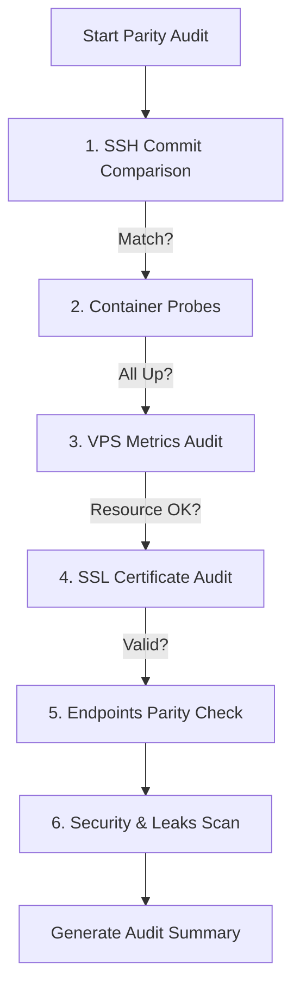

# Technical Implementation Brief: Snapshot Recovery Console (ESSOP)

The Snapshot Recovery Console (ESSOP) is an enterprise-grade web and command-line dashboard designed to manage local containerized environments, capture restorable snapshot checkpoints, execute mandatory snapshot-enforced git deployments, and run deep post-deployment production audits to guarantee parity between local and VPS states.

---

## 1. System Architecture & Directory Isolation

The console is structured to run from a central repository (`C:\ESSOP`) while managing project directories located directly under the `C:\` drive (e.g. `C:\mypools` or `C:\mycities`). Snapshots, environment settings, and secrets are stored in a self-contained manner inside each individual project folder to prevent cross-contamination and ensure that projects can be deleted or moved independently without leaving orphan resources.

### Directory Structure Map

```
C:\
├── ESSOP/                     <-- Core management console
│   ├── server.js              <-- Node.js API server (runs at http://localhost:3050)
│   ├── Refresh-Registry.ps1   <-- PowerShell snapshot indexer
│   ├── Create-Snapshot.ps1    <-- Snapshot creator (files & DB)
│   ├── Restore-Snapshot.ps1   <-- Full disaster recovery restore script
│   ├── Deploy-Git.ps1         <-- Git commit/push & VPS SSH sync script
│   ├── panel.ps1              <-- PowerShell WinForms native desktop GUI
│   ├── projects.json          <-- Persistent project registry configuration
│   ├── registry.json          <-- Machine-readable cache of all project snapshots
│   ├── snapshots-data.js      <-- Cached snapshot metadata formatted for the WinForms grid
│   └── docs/                  <-- Project documentation & implementation plans
│
└── [ProjectName]/             <-- Managed project folder (e.g., C:\mypools)
    ├── compose.yml            <-- Local Podman container configuration
    ├── .env / .env.local      <-- Environment file hosting database & app configs
    ├── .gitignore             <-- Auto-patched to exclude snapshots and secrets
    ├── snapshots/             <-- Directory containing project recovery snapshots
    │   ├── active.txt         <-- Pointer file containing the latest active snapshot name
    │   └── [timestamp]/       <-- Timestamped folder (e.g. 2026-05-22-1030)
    │       ├── project.zip    <-- Compressed archive of project code
    │       ├── database.sql   <-- Database dump (optional)
    │       ├── snapshot.json  <-- Key-value metadata profile
    │       └── recovery.md    <-- Self-contained restore guide
    └── .local/                <-- Isolated connection credentials and SSH settings
        ├── settings.json      <-- VPS connection configuration (SSH host, user, site domain)
        └── ssh.secret.txt     <-- Plaintext password for SSH and SCP transfers (git-ignored)
```

---

## 2. API Endpoints Specification

The Node.js backend server (`server.js`) runs a non-blocking HTTP API and logs real-time automation script output using Server-Sent Events (SSE).

### Project Registry APIs
*   **`GET /api/projects`**: Reads and returns the list of registered project names and directories from `projects.json`.
*   **`POST /api/projects/add`**: Registers a new project directory path.
    *   **Payload**: `{ "path": "C:\\mycities", "name": "mycities" }`
    *   **Logic**: Verifies that the path exists (creates it if missing), extracts the folder basename as the project name if omitted, writes to `projects.json`, initializes local directories `snapshots/` and `.local/`, and runs `Refresh-Registry.ps1`.
*   **`DELETE /api/projects`**: Unregisters a project path mapping from `projects.json`. Does not touch the project files on disk. Triggers `Refresh-Registry.ps1`.

### Snapshot Management APIs
*   **`GET /api/snapshots?project=[name]`**: Refreshes the snapshot registry cache and returns the snapshot history array, metadata, and source paths for a target project.
*   **`POST /api/snapshots/create`**: Spawns `Create-Snapshot.ps1` in a child shell to backup a project.
    *   **Payload**: `{ "project": "mypools", "description": "Manual backup", "live": false, "noDb": false, "excludePaths": "cache,tmp" }`
*   **`POST /api/snapshots/restore`**: Spawns `Restore-Snapshot.ps1` in a child shell to recover a project workspace.
    *   **Payload**: `{ "project": "mypools", "snapshotName": "2026-05-22-1030", "skipPreBackup": false }`

### Git & Deployment APIs
*   **`GET /api/git/status?project=[name]`**: Invokes local git commands inside the project's source directory to fetch the active branch name, untracked file count, modified file count, and details of modified files.
*   **`POST /api/git/deploy`**: Initiates production deployment.
    *   **Payload**: `{ "project": "mypools", "snapshotName": "2026-05-22-1030", "commitMessage": "Deploy release v1.0", "overwriteDb": true }`
    *   **Enforcement Rule**: Rejects request with `400 Bad Request` if `snapshotName` is missing or set to `current-local` to prevent un-checkpointed deployments.

### VPS Settings & Auditing APIs
*   **`GET /api/settings?project=[name]`**: Reads SSH host, user, domain URL, and directory locations from the project's local config files (`.local/settings.json` and `.local/ssh.secret.txt`).
*   **`POST /api/settings`**: Updates and persists SSH connection configuration profiles into the project's `.local/` folder.
*   **`GET /api/parity/check?project=[name]`**: Runs a comprehensive health audit checking local vs production systems and endpoint parity.

---

## 3. Automation Scripts Logic

Automation scripts are written in PowerShell 5.1, incorporating advanced error handling and progress metrics that pipe into the console frontend.

### A. Create-Snapshot.ps1
1.  **Resolve Source**: Reads the target source directory from inputs or `projects.json`.
2.  **GitIgnore Setup**: Automatically appends `snapshots/`, `.snapshots/`, and `.local/` to the project's `.gitignore` file.
3.  **Container Audit**: Probes Podman for compose project containers.
4.  **Database Backup**: If containers are running and database dump is requested:
    *   If running a non-live snapshot, gracefully tears down containers via `podman compose down`. It then spins up only the database container (`mysql`) temporarily to execute the database dump.
    *   Probes container for available dump binaries (`mariadb-dump` or `mysqldump`).
    *   Dumps schema and records to `database.sql` inside the snapshot timestamp directory.
5.  **Files Archiving**: Uses the `System.IO.Compression` assembly to zip the codebase.
    *   **Exclusions**: Excludes heavy user-uploaded contents (`wp-content/uploads`, `wp-content/cache`, `wp-content/upgrade`), local configs, subfolder backups (`snapshots`, `.snapshots`), secrets, git repositories (`.git`), and node modules to avoid recursive archive bloating.
6.  **Metadata Writing**: Creates `snapshot.json` and a markdown guide `recovery.md`.
7.  **Container Recovery**: Restarts the entire compose stack if it was powered down.
8.  **Registry Sync**: Records the new snapshot identifier inside `snapshots/active.txt` and triggers a full registry scan.

### B. Restore-Snapshot.ps1
1.  **Safety Buffer**: Unless explicitly bypassed with `-SkipPreBackup`, it automatically runs `Create-Snapshot.ps1` on the active workspace before overwriting, saving a pre-restore checkpoint.
2.  **Environment Teardown**: Gracefully downs all running Podman containers.
3.  **Process Lock Release**: Force-stops any local `plink.exe` processes to release file locks on the local filesystem.
4.  **Files Extraction**: Extracts `project.zip` over the project directory.
5.  **Database Import**: Starts the database container, probes it for mariadb/mysql binaries, and feeds `database.sql` into the local container.
6.  **Dynamic URL & WordPress Patches**:
    *   Executes SQL commands to update database site url options matching the current HTTP port configuration.
    *   Patches `wp-config.local.php` to define dynamic, environment-aware WordPress URL schemes supporting both HTTP and HTTPS configurations.
    *   Creates or updates the dynamic host/port rewriter Must-Use plugin (`wordpress/wp-content/mu-plugins/mypools-dynamic-urls.php`) to rewrite media resources, assets, script loader paths, and srcset strings dynamically to whichever address the browser uses to connect (e.g. localhost, LAN IP).
7.  **TLS Initialization**: Generates local self-signed certificates if missing.
8.  **Stack Startup & Verification**: Starts the full stack and checks the health status of PHP, Nginx, Redis, and MySQL containers. Performs a local loopback curl check to confirm success.

### C. Refresh-Registry.ps1
*   Loops through all registered paths in `projects.json` (falling back to folder scan if missing).
*   Scans each project's `snapshots` folder (and `.snapshots` fallback) for `snapshot.json`.
*   Assembles details (timestamp, description, size, git branch/commit, database presence) into `registry.json` and `snapshots-data.js` for desktop and web UIs.

### D. Deploy-Git.ps1
1.  **Local Restore**: Forces a local restore of the selected snapshot to the project directory before executing any git steps.
2.  **Commit Check**: Performs a clean stage and local commit. Automatically guarantees `database.sql` is never tracked in git by removing it from the index.
3.  **Remote Push**: Pushes commits to origin branch.
4.  **Database Sync (SCP)**: If database overwrite is enabled, SCPs the SQL file directly to the VPS at `/opt/[ProjectName]/database.sql` using SSH credentials, bypassing GitHub.
5.  **Remote SSH Tracking**: Polls the VPS over SSH via `plink.exe` until the VPS directory's `deploy-status.json` or git logs report a HEAD commit hash matching the deployed commit.
6.  **Remote Health Verification**: Probes VPS container status and tests HTTPS web connectivity. Runs the remote parity check pipeline.

---

## 4. Production Parity Audit Engine

A core feature of the system is the post-deployment Remote VPS Parity Check Engine (`GET /api/parity/check`). It runs an automated diagnostic checklist on the remote server to ensure state consistency:



### Audit Pipeline Verification Steps
1.  **Commit Parity**: Queries the current VPS HEAD commit. Compares it directly to the local HEAD hash to verify the code is fully synchronized.
2.  **Container Probe**: Audits whether the services (`mysql`, `redis`, `php`, `nginx`) are running on the remote VPS Podman system.
3.  **VPS Metrics Audit**: Executes system queries to fetch disk space percentage, memory usage footprint (Used MB / Total MB), and CPU load average to detect resources exhaustion.
4.  **SSL Certificate Audit**: Establishes a TLS connection to the remote domain (e.g. `mypools.co.za`), parses the peer certificate, and extracts the subject domain name, issuer organization, and remaining days until expiration.
5.  **Endpoints Parity**: Synchronously fetches the homepage (`/`), contractors directory (`/contractors`), and admin login page (`/wp-login.php`) from both local and remote servers.
    *   Compares HTTP response status codes.
    *   Compares the HTML document titles to confirm content parity.
    *   Measures and displays local vs remote response latency in milliseconds.
6.  **Security & Leaks Scan**:
    *   **Port Leak Detection**: Scans the production HTML body for leak occurrences of internal local port parameters (e.g. `:9080` or `:9082`) in media references and hyperlinks.
    *   **Database Error Detection**: Probes the page responses for standard database connection failure strings (e.g. "Error establishing a database connection") to verify remote container inter-connectivity.
