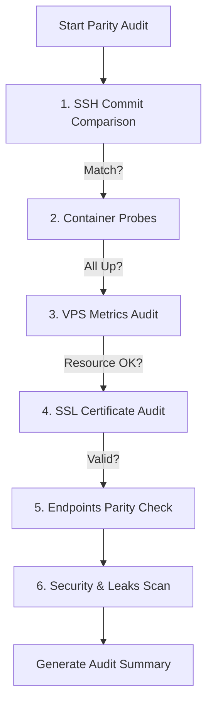

# Technical Implementation Brief: Snapshot Recovery Console (ESSOP)

The Snapshot Recovery Console (ESSOP) is a Windows-native web dashboard (with an optional WinForms desktop panel) for managing local Podman Compose environments — primarily WordPress stacks such as MyPools. It captures restorable snapshot checkpoints, pushes local Git changes to production via CI/CD, optionally syncs databases over SCP, and runs deep local-health diagnostics plus post-deployment VPS parity audits.

**Tech stack:** vanilla Node.js (`server.js`, no npm dependencies), static HTML/CSS/JS frontend (`public/`), PowerShell 5.1 automation scripts, Podman Compose, and PuTTY (`plink.exe` / `pscp.exe`) for remote SSH. Runs at `http://localhost:3050` (launch via `start-panel.bat` or `node server.js`).

---

## 1. System Architecture & Directory Isolation

The console is structured to run from a central repository (`C:\ESSOP`) while managing project directories anywhere on the local filesystem (e.g. `C:\Podman\MyPools`). Snapshots, environment settings, and secrets are stored in a self-contained manner inside each individual project folder to prevent cross-contamination and ensure that projects can be deleted or moved independently without leaving orphan resources.

### Directory Structure Map

```
C:\
├── ESSOP/                     <-- Core management console
│   ├── server.js              <-- Node.js API server (runs at http://localhost:3050)
│   ├── Refresh-Registry.ps1   <-- PowerShell snapshot indexer
│   ├── Create-Snapshot.ps1    <-- Snapshot creator (files & DB)
│   ├── Restore-Snapshot.ps1   <-- Full disaster recovery restore script
│   ├── Deploy-Git.ps1         <-- Git commit/push & VPS SSH sync script
│   ├── panel.ps1              <-- PowerShell WinForms native desktop GUI (legacy)
│   ├── start-panel.bat        <-- Starts server and opens browser
│   ├── projects.json          <-- Persistent project registry configuration
│   ├── registry.json          <-- Machine-readable cache of all project snapshots (git-ignored)
│   ├── snapshots-data.js      <-- Cached snapshot metadata for WinForms grid (git-ignored)
│   ├── public/                <-- Web console frontend (index.html, app.js, style.css)
│   └── docs/                  <-- Project documentation
│
└── [ProjectName]/             <-- Managed project folder (e.g., C:\Podman\MyPools)
    ├── compose.yml            <-- Local Podman container configuration
    ├── .env / .env.local      <-- Environment file hosting database & app configs
    ├── .gitignore             <-- Auto-patched to exclude snapshots and secrets
    ├── Snapshots/             <-- Primary snapshot directory (legacy: .snapshots/)
    │   ├── active.txt         <-- Pointer file containing the latest active snapshot name
    │   └── [timestamp]/       <-- Timestamped folder (e.g. 2026-05-22-1030)
    │       ├── project.zip    <-- Compressed archive of project code
    │       ├── database.sql   <-- Database dump (optional)
    │       ├── snapshot.json  <-- Key-value metadata profile
    │       └── recovery.md    <-- Self-contained restore guide
    └── .local/                <-- Isolated connection credentials and SSH settings
        ├── settings.json      <-- VPS connection configuration (SSH host, user, site domain)
        ├── ssh.secret.txt     <-- Plaintext password for SSH and SCP transfers (git-ignored)
        └── config-backups/    <-- Auto-rolled backups of watched config files
```

---

## 2. API Endpoints Specification

The Node.js backend server (`server.js`) runs a non-blocking HTTP API and logs real-time automation script output using Server-Sent Events (SSE). Only one PowerShell task may run at a time; concurrent requests receive `409 Conflict`.

### Streaming & Infrastructure APIs
*   **`GET /api/logs/stream`**: Server-Sent Events stream of PowerShell stdout/stderr, task status, and progress updates. The web console and mini-terminal subscribe to this endpoint.
*   **`POST /api/server/restart`**: Restarts the ESSOP Node.js server process (used from the Dashboard diagnostics panel).

### Project Registry APIs
*   **`GET /api/projects`**: Reads and returns the list of registered project names and directories from `projects.json`.
*   **`POST /api/projects/add`**: Registers a new project directory path.
    *   **Payload**: `{ "path": "C:\\Podman\\MyPools" }`
    *   **Logic**: Verifies that the path **already exists** on disk (returns `400` if missing), derives the project name from the folder basename, writes to `projects.json`, initializes `Snapshots/` and `.local/` inside the project, starts config-file watchers, and runs `Refresh-Registry.ps1`.
*   **`DELETE /api/projects?project=[name]`**: Unregisters a project path mapping from `projects.json`. Does not touch the project files on disk. Triggers `Refresh-Registry.ps1`.

### Snapshot Management APIs
*   **`GET /api/snapshots?project=[name]`**: Refreshes the snapshot registry cache and returns the snapshot history array, metadata, and source paths for a target project.
*   **`POST /api/snapshots/create`**: Spawns `Create-Snapshot.ps1` in a child shell to backup a project.
    *   **Payload**: `{ "project": "mypools", "description": "Manual backup", "live": false, "noDb": false, "backupLevel": "High", "excludePaths": "cache,tmp" }`
    *   **`backupLevel`**: `"High"` (full recovery), `"Medium"` (code + DB, excludes uploads/secrets), or `"Low"` (framework + app logic, preserves contractor data).
*   **`POST /api/snapshots/restore`**: Spawns `Restore-Snapshot.ps1` in a child shell to recover a project workspace.
    *   **Payload**: `{ "project": "mypools", "snapshotName": "2026-05-22-1030", "skipPreBackup": false }`
*   **`DELETE /api/snapshots?project=[name]&snapshotName=[name]`**: Permanently deletes a snapshot folder and refreshes the registry.

### Git & Deployment APIs
*   **`GET /api/git/status?project=[name]`**: Invokes local git commands inside the project's source directory to fetch the active branch name, untracked/modified file counts, and a list of changed files.
*   **`GET /api/git/versions?project=[name]`**: Returns local, remote (GitHub), and server (VPS) commit hashes with short forms and dirty-state flags. Used by the Git Deployment tab version-parity banner.
*   **`POST /api/git/push`**: **Primary web UI deployment path.** Stages, commits, and pushes the current local workspace to origin.
    *   **Payload**: `{ "project": "mypools", "commitMessage": "Fix gallery port leak", "overwriteDb": false }`
    *   **Logic**: Spawns `Deploy-Git.ps1` with `-GitOnly` (code-only push) or `-OverwriteDatabase` (push + SCP database dump to VPS). CI/CD on the VPS pulls commits automatically.
*   **`POST /api/git/deploy`**: **Legacy snapshot-enforced deployment path** (still available via API; not used by the current web UI).
    *   **Payload**: `{ "project": "mypools", "snapshotName": "2026-05-22-1030", "commitMessage": "Deploy release v1.0", "overwriteDb": true }`
    *   **Enforcement Rule**: Rejects request with `400 Bad Request` if `snapshotName` is missing or set to `current-local`.
*   **`GET /api/git/diff-preview?project=[name]&snapshotName=[name]`**: Computes line additions/deletions comparing the production VPS HEAD commit and the target snapshot commit.

### Local Health & Diagnostic APIs
*   **`GET /api/local-health?project=[name]`**: Returns container status, DB connectivity test, HTTP endpoint checks (homescreen, WordPress, media/thumbnails), configuration diagnostics, LAN IP/ports, and config-backup history.
*   **`POST /api/local-health/fix`**: Applies an automated in-place fix (e.g. dynamic WordPress URLs, nginx upstream, MU-plugin generation).
    *   **Payload**: `{ "project": "mypools", "fixType": "dynamic-urls" }`
*   **`GET /api/local-health/backups?project=[name]`**: Lists rolling config backups from `.local/config-backups/`.
*   **`POST /api/local-health/backups/restore`**: Restores a named backup file to its original path.
    *   **Payload**: `{ "project": "mypools", "filename": "wp-config.local.php.20260522-1430.bak" }`

### VPS Settings, Cleanup & Diagnostic APIs
*   **`GET /api/settings?project=[name]`**: Reads SSH host, user, domain URL, local repository path, deployment branch, and `retentionCount` from the project's local config files (`.local/settings.json` and `.local/ssh.secret.txt`).
*   **`POST /api/settings`**: Updates and persists SSH connection credentials, repository configs, and the snapshot retention policy (`retentionCount`) into the project's `.local/` folder.
*   **`GET /api/project/check-ports?project=[name]`**: Resolves mapped host ports inside the project's `compose.yml` (and `.env` variables) and runs an active socket binding test to verify if any local ports are currently occupied.
*   **`GET /api/project/files?project=[name]`**: Returns a browsable file tree of the project directory for the explorer UI.
*   **`GET /api/containers/stats?project=[name]`**: Queries resource statistics (CPU usage, Memory footprint, and Network IO) from `podman stats` matching the active container stack.
*   **`GET /api/parity/check?project=[name]`**: Runs a comprehensive health audit checking local vs production systems and endpoint parity.

### Directory Selection API
*   **`GET /api/fs/browse`**: Spawns a native Windows `FolderBrowserDialog` using PowerShell WinForms, displaying a GUI path selector on the host desktop and returning the selected folder path.

### Web Console Tabs

The frontend (`public/index.html`) exposes seven sidebar tabs:

| Tab | Purpose |
|-----|---------|
| **Dashboard** | Container monitor, DB/HTTP connectivity, diagnostics & fix console, ESSOP server restart |
| **Create Snapshot** | Snapshot form with backup level, live mode, and custom exclusions |
| **Restore from Snapshot** | Snapshot card grid with restore/delete actions |
| **Git Deployment** | Version parity (Local ↔ Remote ↔ Server), modified files list, push to Git |
| **Health & Parity** | Local ports/resources/paths/config backups; VPS production parity audit |
| **Live Console** | Full-screen SSE log stream with progress bar |
| **Credentials & Settings** | SSH, Git repo path, site URL, VPS root, retention count |

---

## 3. Automation Scripts Logic

Automation scripts are written in PowerShell 5.1, incorporating advanced error handling and progress metrics that pipe into the console frontend.

### A. Create-Snapshot.ps1
1.  **Resolve Source**: Reads the target source directory from inputs or `projects.json`.
2.  **GitIgnore Setup**: Automatically appends `Snapshots/`, `.snapshots/`, and `.local/` to the project's `.gitignore` file.
3.  **Container Audit**: Probes Podman for compose project containers.
4.  **Database Backup**: If containers are running and database dump is requested:
    *   If running a non-live snapshot, gracefully tears down containers via `podman compose down`. It then spins up only the database container (`mysql`) temporarily to execute the database dump.
    *   Probes container for available dump binaries (`mariadb-dump` or `mysqldump`).
    *   Dumps schema and records to `database.sql` inside the snapshot timestamp directory.
5.  **Files Archiving**: Uses the `System.IO.Compression` assembly to zip the codebase.
    *   **Backup levels**: `High` (complete recovery state), `Medium` (code + DB, excludes uploads/secrets), `Low` (framework + app logic, preserves contractor data).
    *   **Exclusions**: Excludes heavy user-uploaded contents (`wp-content/uploads`, `wp-content/cache`, `wp-content/upgrade`), local configs, snapshot folders (`Snapshots/`, `.snapshots/`), secrets, git repositories (`.git`), and node modules to avoid recursive archive bloating.
6.  **Metadata Writing**: Creates `snapshot.json` and a markdown guide `recovery.md`.
7.  **Container Recovery**: Restarts the entire compose stack if it was powered down.
8.  **Registry Sync**: Records the new snapshot identifier inside `Snapshots/active.txt` and triggers a full registry scan.
9.  **Retention Pruning**: If `-RetentionCount` is greater than 0, deletes the oldest directories inside `Snapshots/` exceeding the maximum limit to prevent disk bloat.

### B. Restore-Snapshot.ps1
1.  **Safety Buffer**: Unless explicitly bypassed with `-SkipPreBackup`, it automatically runs `Create-Snapshot.ps1` on the active workspace before overwriting, saving a pre-restore checkpoint.
2.  **Environment Teardown**: Gracefully downs all running Podman containers.
3.  **Process Lock Release**: Force-stops any local `plink.exe` processes to release file locks on the local filesystem.
4.  **Files Extraction**: Extracts `project.zip` over the project directory.
5.  **Database Import**: Starts the database container, probes it for mariadb/mysql binaries, and feeds `database.sql` into the local container.
6.  **Dynamic URL & WordPress Patches**:
    *   Executes SQL commands to update database site url options matching the current HTTP port configuration.
    *   Patches `wp-config.local.php` to define dynamic, environment-aware WordPress URL schemes supporting both HTTP and HTTPS configurations.
    *   Creates or updates the dynamic host/port rewriter Must-Use plugin (`wordpress/wp-content/mu-plugins/mypools-dynamic-urls.php`) to rewrite media resources, assets, script loader paths, and srcset strings dynamically to whichever address the browser uses to connect (e.g. localhost, LAN IP).
7.  **TLS Initialization**: Generates local self-signed certificates if missing.
8.  **Stack Startup & Verification**: Starts the full stack and checks the health status of PHP, Nginx, Redis, and MySQL containers. Performs a local loopback curl check to confirm success.

### C. Refresh-Registry.ps1
*   Loops through all registered paths in `projects.json` (falling back to folder scan if missing).
*   Scans each project's `Snapshots/` folder (and legacy `.snapshots/` fallback) for `snapshot.json`.
*   Assembles details (timestamp, description, size, git branch/commit, database presence) into `registry.json` and `snapshots-data.js` for desktop and web UIs.

### D. Deploy-Git.ps1
Supports two modes controlled by server/API arguments:

**Git-only push** (`POST /api/git/push` without `overwriteDb`):
1.  **Commit Check**: Stages and commits local changes. Guarantees `database.sql` and snapshot archives are never tracked in git.
2.  **Remote Push**: Pushes commits to origin branch.
3.  **Remote SSH Tracking**: Polls the VPS until `deploy-status.json` or git logs report a matching HEAD commit.

**Full deployment** (`POST /api/git/push` with `overwriteDb: true`, or `POST /api/git/deploy` with `-SnapshotName`):
1.  **Local Restore** *(deploy path only)*: Restores the selected snapshot locally before git steps.
2.  **Commit Check**: Stages and commits. Removes `database.sql` and snapshot archives from the git index.
3.  **Remote Push**: Pushes commits to origin branch.
4.  **Database Sync (SCP)**: If database overwrite is enabled, SCPs the SQL file directly to the VPS at `/opt/[ProjectName]/database.sql` using SSH credentials, bypassing GitHub.
5.  **Remote SSH Tracking**: Polls the VPS over SSH via `plink.exe` until the VPS directory's `deploy-status.json` or git logs report a HEAD commit hash matching the deployed commit.
6.  **Remote Health Verification**: Probes VPS container status and tests HTTPS web connectivity.

---

## 4. Production Parity Audit Engine

A core feature of the system is the post-deployment Remote VPS Parity Check Engine (`GET /api/parity/check`). It runs an automated diagnostic checklist on the remote server to ensure state consistency:



### Audit Pipeline Verification Steps
1.  **Commit Parity**: Queries the current VPS HEAD commit. Compares it directly to the local HEAD hash to verify the code is fully synchronized.
2.  **Container Probe**: Audits whether the services (`mysql`, `redis`, `php`, `nginx`) are running on the remote VPS Podman system.
3.  **VPS Metrics Audit**: Executes system queries to fetch disk space percentage, memory usage footprint (Used MB / Total MB), and CPU load average to detect resources exhaustion.
4.  **SSL Certificate Audit**: Establishes a TLS connection to the remote domain (e.g. `mypools.co.za`), parses the peer certificate, and extracts the subject domain name, issuer organization, and remaining days until expiration.
5.  **Endpoints Parity**: Synchronously fetches the homepage (`/`), contractors directory (`/contractors`), and admin login page (`/wp-login.php`) from both local and remote servers.
    *   Compares HTTP response status codes.
    *   Compares the HTML document titles to confirm content parity.
    *   Measures and displays local vs remote response latency in milliseconds.
6.  **Security & Leaks Scan**:
    *   **Port Leak Detection**: Scans the production HTML body for leak occurrences of internal local port parameters (e.g. `:9080` or `:9082`) in media references and hyperlinks.
    *   **Database Error Detection**: Probes the page responses for standard database connection failure strings (e.g. "Error establishing a database connection") to verify remote container inter-connectivity.
