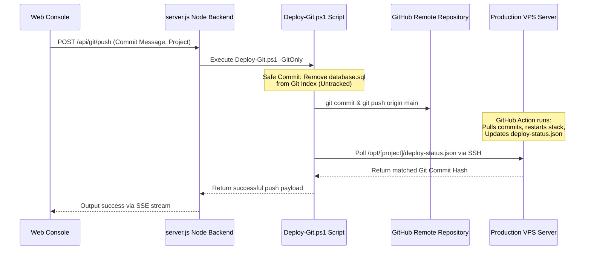
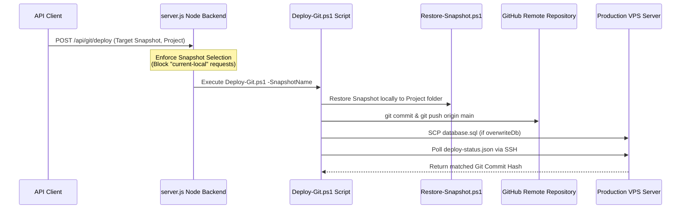

# Technical Code Walkthrough: Snapshot Recovery Console (ESSOP)

This document provides a detailed step-by-step walkthrough of the codebase, project flows, automation scripts, and validation mechanisms implemented in the Snapshot Recovery Console (ESSOP).

---

## 1. Project Directory Layout & Configuration

The console leverages a dynamic project registry mapping project folders to the console's UI. 

### Initial Configuration (`projects.json`)
The application registry maps project names to absolute folder paths:
```json
[
  {
    "name": "mypools",
    "path": "C:\\Podman\\MyPools"
  },
  {
    "name": "ESSOP",
    "path": "C:\\ESSOP"
  }
]
```
These mappings allow the system to load settings, SSH passwords, and container details relative to the selected project's path dynamically.

### Web Console Layout

The web UI (`http://localhost:3050`) provides seven sidebar tabs: **Dashboard**, **Create Snapshot**, **Restore from Snapshot**, **Git Deployment**, **Health & Parity**, **Live Console**, and **Credentials & Settings**. A floating mini-console dock streams PowerShell output during background tasks.

---

## 2. Step-by-Step Operations Walkthrough

### Step 2.1: Registering a Project Folder
1.  **Directory Selection**: In the Web UI, click **Add Project** in the header bar, then use **Browse...** to open a native Windows `FolderBrowserDialog` or type the path (e.g. `C:\Podman\MyPools`) manually.
2.  **Add Request**: Clicking **Add Project** sends a registration call to the backend.
3.  **API Verification**: The endpoint `POST /api/projects/add` resolves the path. The directory **must already exist** on disk — the API returns `400` if it does not. It derives the project name from the folder basename and appends the registration mapping to `projects.json`.
4.  **Workspace Isolation**: The console automatically initializes the target workspace by creating a `Snapshots/` directory to hold snapshots and a `.local/` directory to store project settings and config backups.
5.  **Registry Rebuild**: The console calls `Refresh-Registry.ps1` to index all snapshots and starts config-file watchers for automatic backup on write.

### Step 2.2: Creating a Recovery Snapshot
1.  **Selection**: The user selects a project (e.g. `mypools`) and opens the **Create Snapshot** tab, providing a description (e.g. "Pre-release patch").
2.  **Backup Level**: Choose **High** (full recovery), **Medium** (code + DB, no uploads/secrets), or **Low** (framework only, preserves contractor data).
3.  **Environment Probe**: `Create-Snapshot.ps1` checks for Podman and retrieves environment configurations (like database passwords and project names) from the project's `.env` or `.env.local` files.
4.  **Container Teardown (Powered-Off Snapshot)**: If `Live` mode is not selected, the script calls `podman compose down` to stop all containers, preventing write operations during backup.
5.  **Database Dump**: The script starts just the database container, probes it for mariadb-dump or mysqldump, and dumps the schema to `C:\Podman\MyPools\Snapshots\[timestamp]\database.sql`.
6.  **Files Archiving**: The project directory files are compressed into `project.zip` using the `ZipArchive` library. To keep the backups lightweight, critical folders and files (like `wp-content/uploads`, `.git/`, `node_modules/`, and the `Snapshots/` folder itself) are explicitly ignored.
7.  **Gitignore Security**: The script automatically checks `.gitignore` in the project root, adding rules to block `Snapshots/`, `.snapshots/`, and `.local/` from ever being staged or committed to git.
8.  **Metadata Generation**: Writes metadata details (timestamp, description, size, git branch/commit hash, backup level) to `snapshot.json` and creates a markdown recovery manual `recovery.md`.
9.  **Re-Initialize & Prune**: 
    *   Containers are restarted via `podman compose up -d`.
    *   `active.txt` is updated with the timestamp.
    *   If a snapshot retention limit is set (e.g. 5), the oldest snapshot folders in `Snapshots/` are automatically deleted to clean up disk space.
    *   `Refresh-Registry.ps1` runs to re-index the registry.

### Step 2.3: Restoring a Snapshot
1.  **Safety Buffer**: `Restore-Snapshot.ps1` first executes `Create-Snapshot.ps1` with the `-Live -NoDatabase` flags, securing a backup of the current workspace files before restoring.
2.  **Teardown**: The script calls `podman compose down` on all running containers.
3.  **File Lock Release**: It terminates any active `plink.exe` processes to release file locks on the local directory.
4.  **Files Extraction**: Extracts the selected snapshot's `project.zip` directly over the project directory, replacing all files.
5.  **Database Import**: Starts the database container, waits for health checks to pass, and pipes the snapshot's `database.sql` into the container.
6.  **Configuration Patches**:
    *   **wp-config.local.php**: The script patches this file, inserting environment-aware definitions for `WP_HOME` and `WP_SITEURL` to support both local HTTP/HTTPS configurations dynamically.
    *   **WordPress MU-Plugin**: Generates or updates `wordpress/wp-content/mu-plugins/mypools-dynamic-urls.php`. This plugin intercepts WordPress resource URLs, rewrites, and asset paths in real-time, redirecting links to match whichever host/port (localhost, LAN IP, or custom proxy) the developer uses to access the container.
7.  **TLS certificates**: Generates local edge SSL certificates if missing.
8.  **Stack Wakeup**: Restarts the entire compose stack and checks container health.

### Step 2.4: Git Push to Production (Primary Web UI Flow)


1.  **Version Parity Check**: The Git Deployment tab displays Local, Git Remote, and Server commit hashes via `GET /api/git/versions`. When remote and server are out of sync, the UI polls every 8 seconds until parity is restored.
2.  **Modified Files Review**: `GET /api/git/status` lists modified and untracked files in the local working tree.
3.  **Push Action**: The user enters a commit message and clicks **Push to Git**. This calls `POST /api/git/push` with the current local workspace (no snapshot selection required).
4.  **Git Cleanup**: `Deploy-Git.ps1` verifies that `database.sql` is removed from the git index and deletes any local SQL dump inside the repository to keep git commits code-only.
5.  **Local Commit & Push**: Code changes are staged, committed, and pushed to origin. CI/CD on the VPS pulls and deploys automatically.
6.  **Optional Database Overwrite**: If `overwriteDb: true` is sent in the payload, the script SCPs `database.sql` from the active snapshot to `/opt/[project]/database.sql` on the VPS and restores it remotely.
7.  **Polling Deployment State**: The script polls `/opt/[project]/deploy-status.json` on the VPS over SSH until the remote commit matches the local HEAD commit hash.

### Step 2.5: Snapshot-Enforced Deployment (Legacy API Path)

The endpoint `POST /api/git/deploy` remains available for programmatic use but is **not exposed in the current web UI**. It requires a valid `snapshotName` and rejects `current-local`:



1.  **Mandatory Selection**: `snapshotName` must be a valid recovery snapshot ID; `"current-local"` returns `400 Bad Request`.
2.  **Local Workspace Alignment**: `Deploy-Git.ps1` calls `Restore-Snapshot.ps1` locally first, aligning the workspace with the target snapshot before committing.
3.  **Remaining steps** follow the same commit, push, SCP, and polling pipeline as Step 2.4.

---

## 3. Local Health & Diagnostics

Local health data is served by `GET /api/local-health` and rendered in two places in the web UI:

*   **Dashboard tab** — container status grid, MariaDB connectivity, HTTP checks (homescreen, WordPress, media/thumbnails), and the diagnostics & fix console with one-click repairs.
*   **Health & Parity tab → Local Health & Paths sub-panel** — port conflict monitor, container resource stats, WordPress test-path cards (local + LAN), and config-backup history with preview/restore.

Config files (`.env`, `compose.yml`, nginx configs, `wp-config.local.php`) are watched at server boot via `fs.watch`. On change, timestamped backups are saved to `<project>/.local/config-backups/` (last 15 per file retained).

---

## 4. Remote VPS Parity & Health Verification Checks

The parity verification checks run automatically at the end of the deployment pipeline and can be triggered on-demand via the Web Console interface.

### Detailed Check Flow

#### 1. Git Commit Parity
*   **Action**: Runs `git rev-parse HEAD` locally and queries `/opt/[project]/deploy-status.json` (falling back to `git log -1` on VPS) to fetch the deployed commit hash.
*   **Result**: Confirms if the local commit hash matches the VPS commit hash.

#### 2. Container Status
*   **Action**: Probes local containers vs VPS containers by executing `podman ps` for compose services.
*   **Result**: Displays if the core containers (`mysql`, `redis`, `php`, `nginx`) are active and reporting healthy statuses.

#### 3. VPS System Metrics
*   **Action**: Runs diagnostics over SSH to monitor system metrics.
*   **Diagnostics**:
    *   `df -h / | tail -n 1` (Disk space status)
    *   `free -m | grep Mem` (Memory footprint status)
    *   `uptime` (System load averages)

#### 4. SSL Certificate Audit
*   **Action**: Connects to port 443 of the production domain (e.g. `mypools.co.za`) and parses the certificate.
*   **Result**: Displays issuer, subject name, expiration date, and flags warnings if the certificate has expired or is expiring soon.

#### 5. Endpoints Parity Check
*   **Action**: Fetches HTML source code from both local loopback URLs (`http://127.0.0.1:[port]/`) and production URLs (`https://[domain]/`) for key pages.
*   **Probed Pages**:
    *   `/` (Homepage)
    *   `/contractors` (Contractors directory)
    *   `/wp-login.php` (Admin login screen)
*   **Audits**:
    *   Verifies that local and production HTTP status codes match.
    *   Verifies HTML `<title>` tags match to confirm page content parity.
    *   Measures response time latency for both hosts.

#### 6. Security & Leaks Scan
*   **Port Leak Detection**: Inspects the production HTML body to ensure that no references to internal local ports (such as `:9080` or `:9082`) have leaked into media source links or anchor tags.
*   **Database Error Detection**: Scans page outputs for strings such as "Error establishing a database connection" or "WordPress database error" to confirm that connection configurations are correctly set up and containers are communicating.

---

## 5. Verification & Validation Results

Below are samples of verification logs and JSON response schemas returned by the API during system operation.

### A. Deploy Validation Constraint (Legacy Snapshot Deploy API)
*   **Action**: POST to `/api/git/deploy` with `"snapshotName": "current-local"`.
*   **Response**: Correctly blocks the request, returning `400 Bad Request` and message:
    ```json
    {
      "error": "A valid recovery snapshot must be selected to initiate deployment."
    }
    ```

### B. Project Addition API Check
*   **Action**: POST to `/api/projects/add` with `{ "path": "C:\\Podman\\MyPools" }` (folder must exist).
*   **Response**: Registers mapping, initializes `Snapshots/` and `.local/`, and rebuilds registry cache:
    ```json
    {
      "success": true,
      "projects": ["mypools", "ESSOP", "MyPools"],
      "details": [
        { "name": "mypools", "path": "C:\\Podman\\MyPools" },
        { "name": "ESSOP", "path": "C:\\ESSOP" },
        { "name": "MyPools", "path": "C:\\Podman\\MyPools" }
      ]
    }
    ```

### C. VPS Parity Check Audit Schema
*   **Action**: GET to `/api/parity/check?project=MyPools`.
*   **Response**: Compiles and returns system metrics, container statuses, and endpoint tests:
    ```json
    {
      "git": {
        "localCommit": "d8f1e2a",
        "vpsCommit": "d8f1e2a",
        "parity": true
      },
      "containers": {
        "local": {
          "mysql": "running",
          "redis": "running",
          "php": "running",
          "nginx": "running"
        },
        "vps": {
          "mysql": "running",
          "redis": "running",
          "php": "running",
          "nginx": "running"
        }
      },
      "endpoints": [
        {
          "path": "/",
          "name": "Homepage",
          "localStatus": 200,
          "localTime": 45,
          "localTitle": "MyPools - Swimming Pool Maintenance & Services",
          "prodStatus": 200,
          "prodTime": 120,
          "prodTitle": "MyPools - Swimming Pool Maintenance & Services",
          "portLeak": false,
          "dbError": false,
          "titleParity": true
        },
        {
          "path": "/contractors",
          "name": "Contractors Directory",
          "localStatus": 200,
          "localTime": 50,
          "localTitle": "Contractors Directory - MyPools",
          "prodStatus": 200,
          "prodTime": 140,
          "prodTitle": "Contractors Directory - MyPools",
          "portLeak": false,
          "dbError": false,
          "titleParity": true
        }
      ],
      "security": {
        "portLeakDetected": false,
        "dbErrorDetected": false,
        "ssl": {
          "valid": true,
          "subject": "mypools.co.za",
          "issuer": "Let's Encrypt",
          "expiry": "2026-08-20T12:00:00Z",
          "daysRemaining": 90
        }
      },
      "system": {
        "diskUsage": "45%",
        "memoryUsage": "2450 MB / 7980 MB",
        "cpuLoad": "0.15, 0.08, 0.02"
      }
    }
    ```
