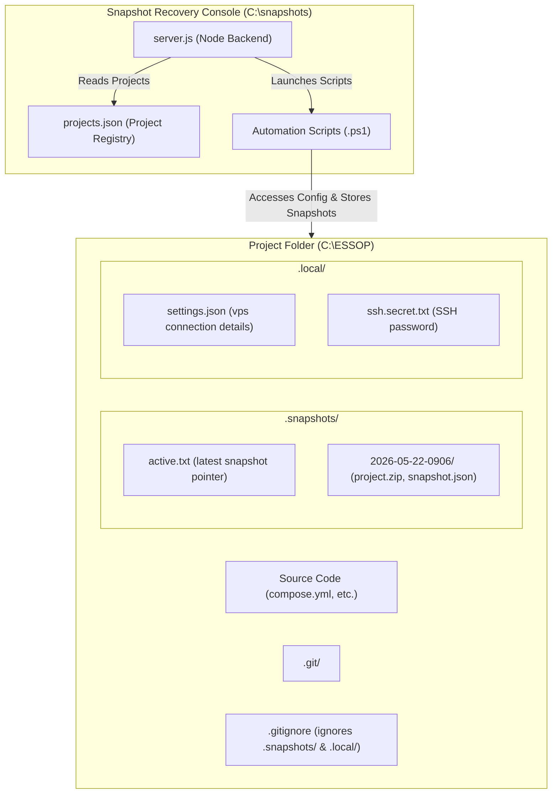

# Walkthrough: Dynamic Multi-Project Console & Snapshot-Enforced Deployments

I have successfully generalized the Snapshot Recovery Console into a dynamic, multi-project management dashboard, isolated project credentials and snapshots to be self-contained within each project directory, and enforced git deployments strictly from completed snapshots.

---

## 1. Summary of Changes

We expanded the console application located at `C:\snapshots\`:

1. **Dynamic Project Registry**:
   - Added a persistent `projects.json` file to store paths for active projects.
   - Added APIs (`POST /api/projects/add` and `DELETE /api/projects`) to dynamically register and unregister project directories via the UI.
   - Initialized the console with the default `mypools` path (`C:\Podman\MyPools`).

2. **Self-Contained Storage & Isolation**:
   - Moved snapshot storage to `[ProjectFolder]\.snapshots\`.
   - Moved settings and SSH secrets to `[ProjectFolder]\.local\settings.json` and `[ProjectFolder]\.local\ssh.secret.txt`.
   - Programmed the console to automatically append `.snapshots/` and `.local/` to the project's `.gitignore` to ensure backups and secrets are never committed.
   - Added `.snapshots` to the backup exclusions list in `Create-Snapshot.ps1` to prevent recursive archive bloating.

3. **Mandatory Snapshot-Based Git Deployments**:
   - Removed the legacy "Current Local Workspace" option from the Git Deploy dropdown in the UI.
   - Disabled the "Push to Production" button unless a valid recovery snapshot is selected.
   - Configured `POST /api/git/deploy` in `server.js` to return `400 Bad Request` if `snapshotName` is missing or equal to `current-local`.
   - Configured `Deploy-Git.ps1` to require `-SnapshotName` as a mandatory parameter, executing a local snapshot restore before staging, committing, and pushing.

4. **Automation Scripts Updates**:
   - **`Refresh-Registry.ps1`**: Loops through the registered projects from `projects.json` and indexes their respective `.snapshots/` folders.
   - **`Create-Snapshot.ps1`**: Writes snapshots to `$Source\.snapshots\$timestamp\`, saves the latest snapshot pointer in `$Source\.snapshots\active.txt`, and automatically updates `.gitignore`.
   - **`Restore-Snapshot.ps1`**: Restores files and databases directly from local `$Source\.snapshots\$SnapshotName\`.
   - **`Deploy-Git.ps1`**: Enforces deployment from snapshots, restoring the snapshot locally first, then staging and pushing, followed by SSH VPS synchronization and health check parity audits.

---

## 2. Pipeline & Isolation Flow

The following diagram illustrates the isolated directory layout and deployment sequence:



---

## 3. Verification & Validation Results

We executed comprehensive validation checks to ensure correctness:

### A. Deploy Validation Constraint Test
- **Action**: Posted a deployment payload targeting `"snapshotName": "current-local"`.
- **Result**: The API correctly rejected the request with `HTTP/1.1 400 Bad Request` and returned:
  ```json
  {"error":"A valid recovery snapshot must be selected to initiate deployment."}
  ```

### B. Project Isolation & Mapping Check
- **Action**: Queried `GET /api/projects` to list mapped environments.
- **Result**: Correctly returned the dynamically registered paths:
  ```json
  {
    "projects": ["mypools", "ESSOP"],
    "details": [
      { "name": "mypools", "path": "C:\\Podman\\MyPools" },
      { "name": "ESSOP", "path": "C:\\ESSOP" }
    ]
  }
  ```

### C. Snapshot Creation & Exclusion Verification
- **Action**: Ran `Create-Snapshot.ps1` for the `ESSOP` project directory.
- **Result**:
  - The snapshot was written to `C:\ESSOP\.snapshots\2026-05-22-0906\`.
  - `.snapshots/` and `.local/` were appended to `.gitignore`.
  - The `.snapshots` directory was correctly excluded from the archive zip, zipping only the `compose.yml` file, yielding a clean `1 files (0 MB)` archive and preventing infinite backup recursion.
  - Snapshot registry was automatically updated and synced.
